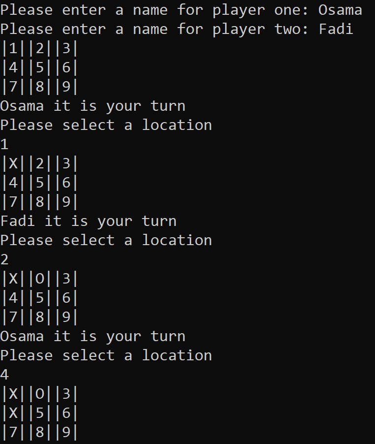
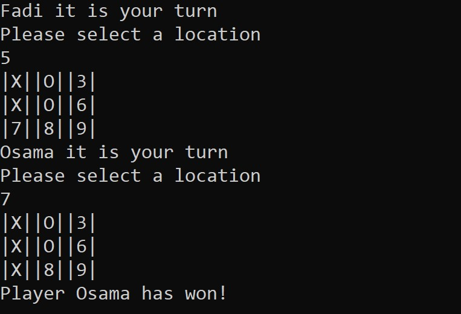
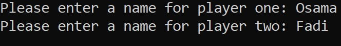
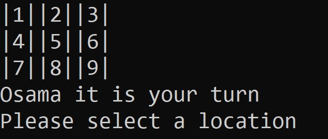
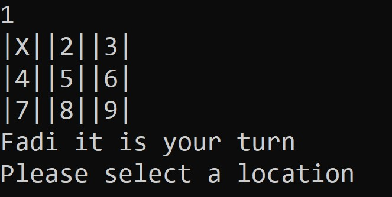
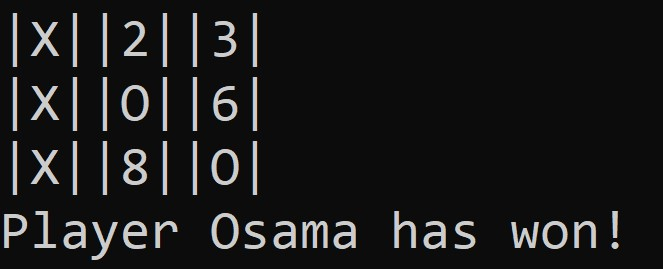

# Lab04-tic-tac-toe
## What is this game?
It is a classic Tic-Tac-Toe game with two players where they alternate taking turns on a 3*3 game board until one of them gets 3 markers(X/O) in a row or the board is full with a tie/draw. So the first player is X and the second player is O, the game prompts the first player to enter his/her name then the second player follows. After that, a game board appears on a console app, so each player can pick a location until we have a winner or it's a draw.

---
## Visuals
These pictures were taken from the game.

**Note:** to start the game, just run the app and follow the steps below.

---
## Step by step directions, "Happy Path" walk through:
1. First player has to enter his name, then the second player follows.

	
2. A game board of 9 locations appear, a message prompts the first player to select a location by entering a number from 1-9. First player marker is set to X and second is O.

	

3. Then the second player chooses his/her location.

	
4. Both players will keep taking turns until we have a winner or a draw in case the board is full and there is no winner.

	
	
---
## Other relevant details:
+ If a player enters wrong location such as 0, 10 and 11, the game will ask him/her to enter a location and nothing will happen. This also will be applied if a wrong format is entered like a string or a character.

+ If a player chose an occupied location, a message will appear and ask the player to choose another location. Turns won't be affected since the player will retake his/her turn to choose a correct location.